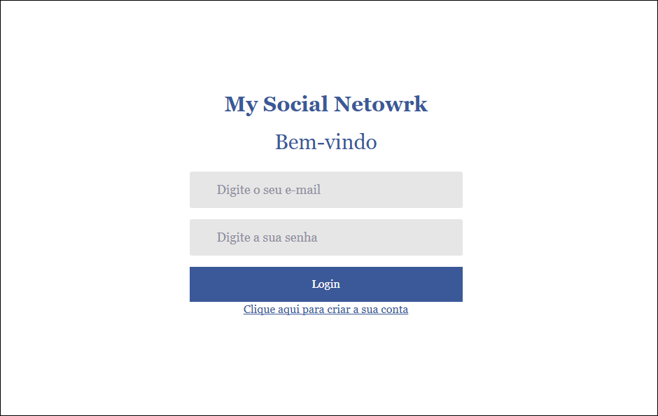
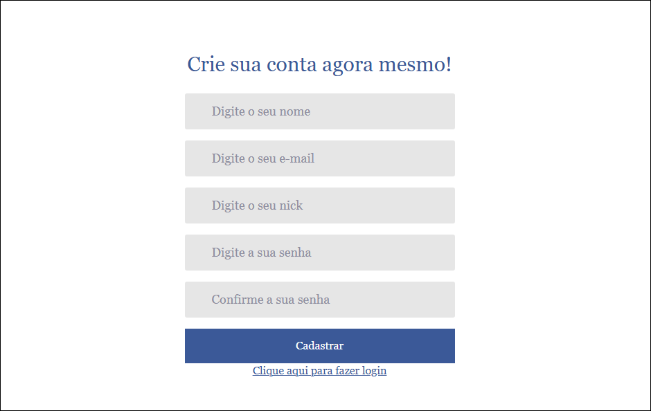
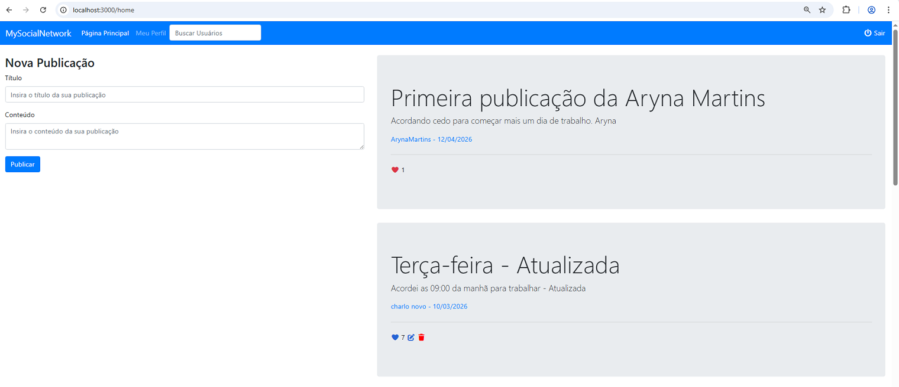
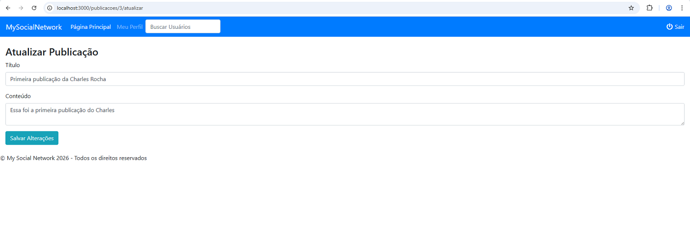
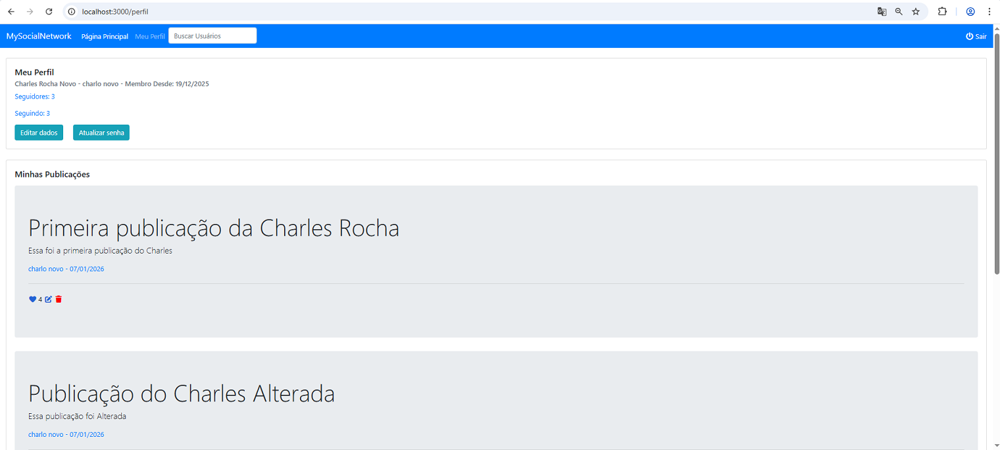
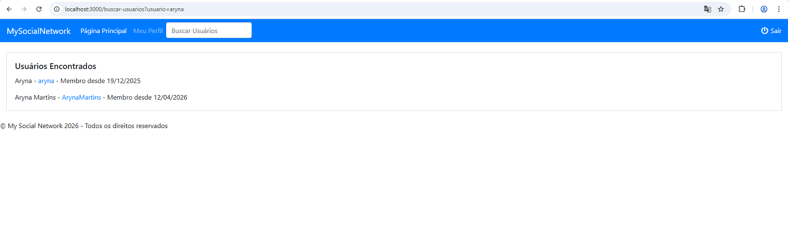
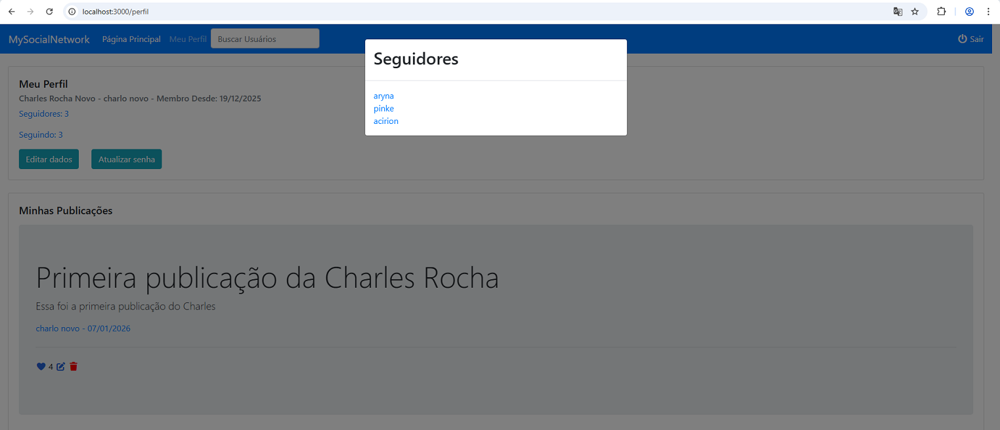

<h1 align="center">    
    
My Social Network

        
	      
    		
	  
    
	      
    
	      
    
	      
    
	      
    
	      
    
</h1>

## Índice
- [Sobre](#-sobre)
- [Feramentas](#-ferramentas)
- [Funcionalidades](#-funcionalidades)
- [Licença](#-licença)

## 📘 Sobre

**Projeto de Simulação de uma Rede Social com Golang**.

**Tempo total de desenvolvimento do projeto:** 4 meses, em tempos livres. 

## 🛠 Ferramentas

- [BCrypt](https://pkg.go.dev/golang.org/x/crypto/bcrypt)
- [Css](https://www.w3.org/Style/CSS/)
- [Git](https://git-scm.com/)
- [Golang](https://go.dev/)
- [Gorilla Mux](https://github.com/gorilla/mux)
- [Javascript](https://developer.mozilla.org/pt-BR/docs/Web/JavaScript)
- [jQuery](https://jquery.com/)
- [JWT - JSON Web Token](https://github.com/dgrijalva/jwt-go)
- [MySQL](https://www.mysql.com/)
- [Postman](https://www.postman.com/explore)
- [SecureCookie](https://pkg.go.dev/github.com/chmike/securecookie)
- [SweetAlert2](https://sweetalert2.github.io/)
- [Visual Studio Code](https://code.visualstudio.com/)

## 💡 Executando a Aplicação

- **Execução da API**: Executar o arquivo api.exe localizado na pasta **\MySocialNetwork\api\api.exe**. A API estará rodando na porta 3300.
- **Execução do Site (webapp)**: Executar o arquivo webapp.exe localizado na pasta **\MySocialNetwork\webapp\webapp.exe**. O Site estará rodando na porta 3000.

## 💡 Funcionalidades

- **Tela de Login**: Primeira tela que é mostrada ao usuário, que serve basicamente para logar no sistema, ou criar um usuário caso ainda não possua.
- **Tela de Criação de Usuário**: Tela para criação de usuário para ser utilizado no sistema **MySocialNetwork**.
- **Página Principal**: Mostra a página principal com as **Publicações** do usuário logado e também dos usuários ao qual está sendo seguido. É possível também criar uma nova publicação, curtir ou descurtir a publicação de um usuário que está seguindo. 
- **Buscar Usuário**: Tela para buscar um usuário no sistema **MySocialNetwork**, onde, após encontrado o usuário, tem-se a possibilidade de **Seguir** ou **Parar de Seguir** esse usuário.
- **Lista de Seguidores**: Mostra uma pequena lista de usuárioe ao qual o usuário logado está sendo seguido.
- **Lista de Seguindo**: Mostra uma pequena lista de usuários ao qual o usuário logado está seguindo.
- **Meu Perfil**: Carrega a página do perfil do usuário logado, mostrando suas publicações criadas e também com as opções de **Editar Dados** e **Atualizar Senha**.
  - **OBS.:** Ao final da página, tem uma opção para **Excluir Conta Permanentemente**. Ao clicar nesse botão, é mostrado um alerta ao usuário informando que essa ação é irreversível.
- **Sair**: Realiza o logout do sistema **MySocialNetwork** e retorna para a tela de login.

## 📄 Licença

Esse software é **free** e foi construído para realizar um **Projeto de Simulação de uma Rede Social com Golang**.

